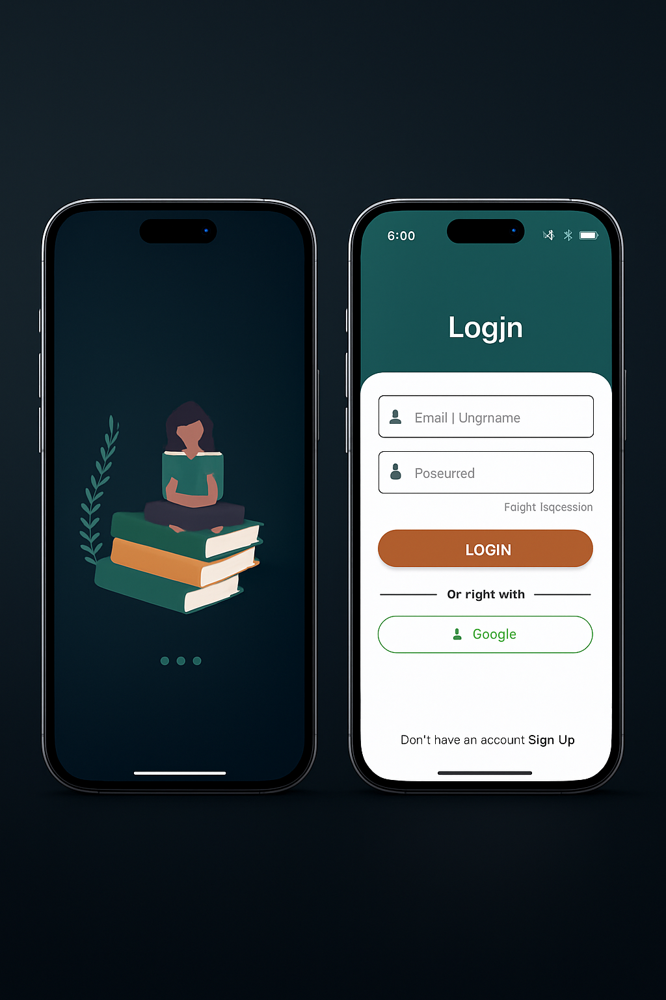
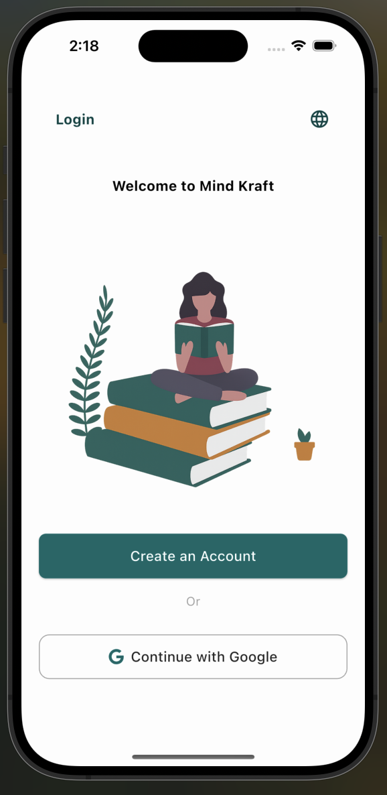
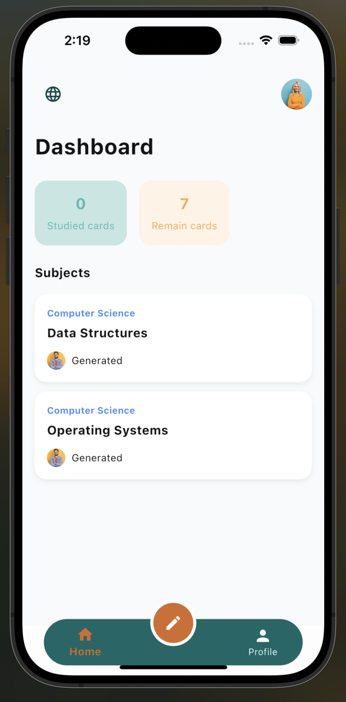
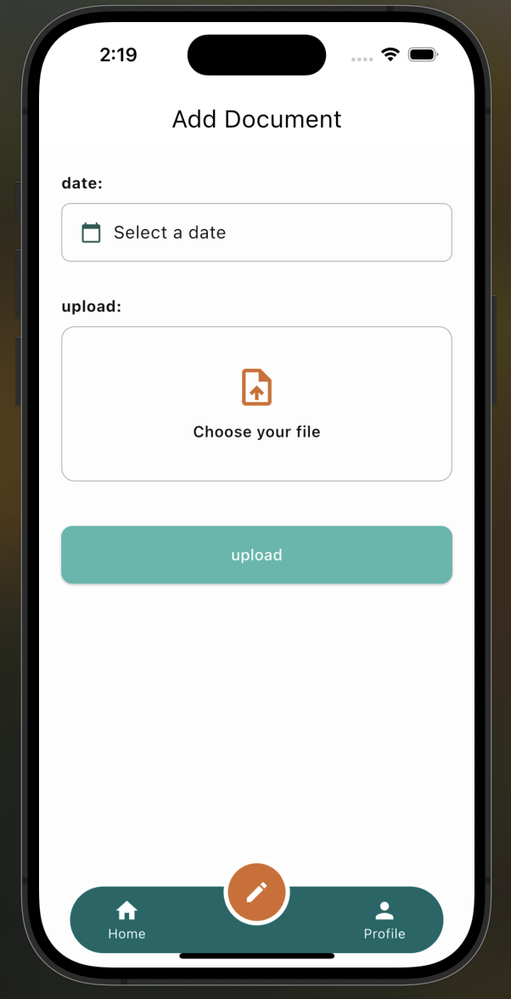
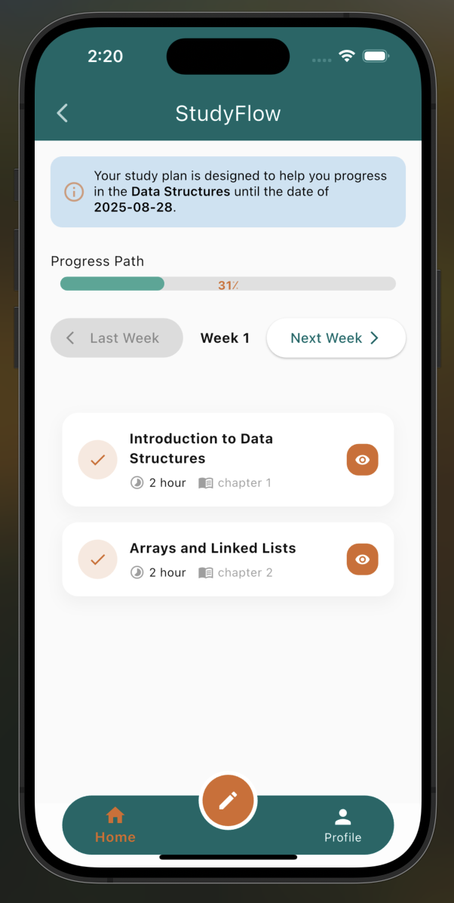

# MindKraft


MindKraft is a Flutter-based mobile application designed to provide an intuitive and engaging user experience.

---

## Key Technologies & Skills Used

- **Freezed:** Immutable data classes and unions with code generation for clean and maintainable state management.
- **Localization (Multi-language support):** The app supports multiple languages to reach a wider audience.
- **Parse Server:** Backend as a service (BaaS) for user management, data storage, and real-time features.
- **OpenAI API Integration:** Leveraging AI capabilities for advanced functionalities such as natural language processing.
- **State Management:** Efficient handling of app state for a smooth user experience.
- **Custom UI & Animations:** Tailored UI components and animations for enhanced visual appeal.

---

## Screenshots

<table>
  <tr>
    <td align="center">
      
      <br/>
<!--       <sub>Splash and login screen </sub> -->
    </td>
    <td align="center">
      
      <br/>
<!--       <sub>Clean and modern login interface</sub> -->
    </td>
    <td align="center">
      
      <br/>
<!--       <sub>Another screen description</sub> -->
    </td>
     <td align="center">
      
      <br/>
<!--       <sub>Another screen description</sub> -->
    </td>
     <td align="center">
      
      <br/>
     
 
  </tr>
</table>

---

## How to Run

1. Clone the repo:
   ```bash
   git clone https://github.com/yourusername/mindkraft.git

